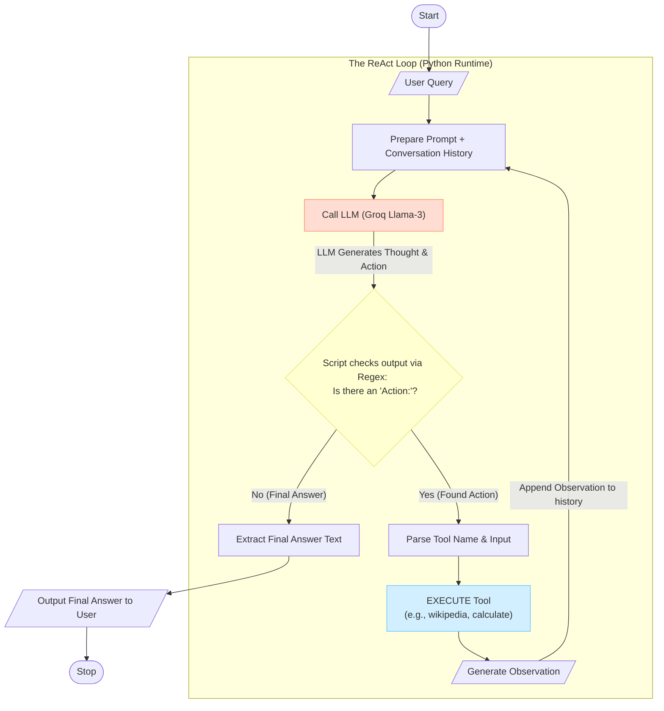

# react_agent_from_scratch
A bare-metal implementation of the ReAct (Reasoning + Acting) pattern using Python and Groq. This notebook demonstrates how to build an autonomous AI agent from first principles without relying on high-level agent abstractions.

# 🧠 ReAct Agent: From Scratch

> **"What if we stripped away the magic?"** > A bare-metal implementation of the **ReAct (Reasoning + Acting)** pattern. This project demonstrates how to build an autonomous AI agent from first principles using Python, Regex, and Groq's Llama 3, without relying on high-level agent abstractions.

---
## 🏗️ Architecture: The ReAct Loop

How does the agent actually "think"? The diagram below illustrates the iterative cycle of Reasoning (`Thought`), Tool Use (`Action`), and Perception (`Observation`) implemented in this notebook.

